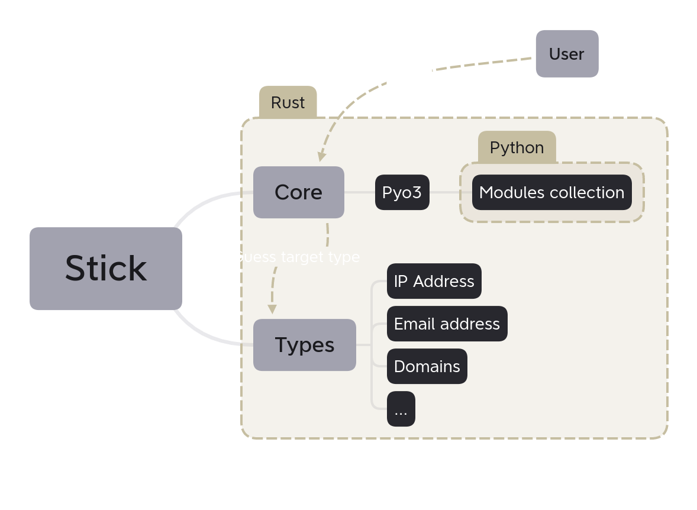

# Stick

An OSINT tool similar to [Squiz](https://github.com/traumatism/squiz) but in... [Rust](https://rust-lang.org)!

Yes... the cute crab seduced me... but I am not quitting Python at all (at least now ^^): indeed, Stick uses [Python 3](https://python.org/) as a scripting language to write modules!

Since I am a brain-dead kid without any imagination, module suggestions are welcome (open an issue, or tell me directly on Discord: toast~#0001. For other social platforms see [this link](https://traumatism.github.io/).

Warning: some of the modules might be sending direct requests to the target if it's a host, domain, or URL... you MUST have the target's authorization to perform a scan on their system. Otherwise here is a cool [VPN service](https://mullvad.net/).



## Usage

1. build it from the source code and move the binary to our current location.

`cargo build && mv target/debug/stick .`

2. if it's not present, create the modules folder.

`mkdir modules/`

2. (b) create a hello world module

`python3 create_module hello`

3. run stick on the target of your choice, stick will detect what you wanna do automatically

`./stick 1.1.1.1`

`./stick domain.tld`

`./stick user@domain.tld`

`./stick 1.1.1.1:80`

`./stick https://1.1.1.1:80`

## Create a module

`python3 create_module.py <name>` will create a new Python file in `modules/` and register your module to `modules.json`.

To delete your module, you have to remove it both from `modules/` and `modules.json`

### ModuleInfos class

The `ModuleInfos` class contains information that categorizes modules.

```python

class ModuleInfos:

    name = "hello"
    target_types = ["ip_address", "url"]
    author = "toast <toast@mailfence.com>"
    desc = "Just an example module"

```

The `to_json` method is necessary for the bridge between Rust and Python, edit it at your own risk!

```python
    def to_json(self) -> str:
        return json.dumps({
            "name": self.name,
            "target_types": self.target_types,
            "author": self.author,
            "desc": self.desc,
            "file_path": "".join(__file__.split(".py")[:-1])
        })
```

### Execute function

Your module code will go in the `execute` function which takes a string as an argument. This string contains the target provided by the user.

Notes:
    - This function is not a method of the `ModuleInfos` class.
    - Yes, Pythons scripts can communicate with system Python modules (httpx, rich, asyncio...)
    - No, Python scripts do not support relative imports (`from .thirdparty import *` etc.)

```python
def execute(target: str):
    ...
```

This execute function must return a JSON string (use `json.dumps({ ... })` to correctly encode a JSON as string)

### Results structure


```json

// Results, this is at the top-level
{
    "results": [  ] // array < Node >
}

// Node, this is at the middle-level
{
    "name": "...", // String
    "rows": [  ], // array < Row >
}

// Row, this is at the lowest level
{
    "key": "...", // String
    "value": "...", // String
}

```
